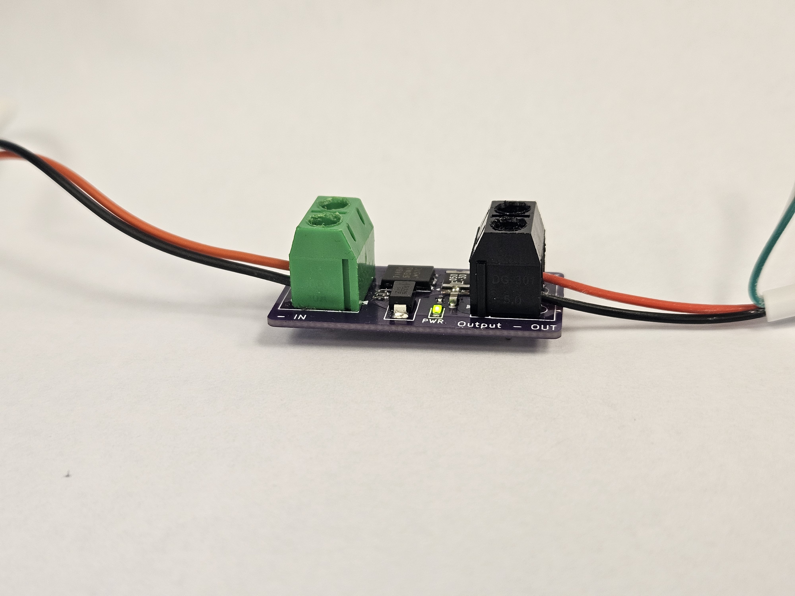

# [DevGuard 24](https://www.tindie.com/products/41136/)  
### Inline 3–24V Protection Module

  <!-- Replace with actual image -->
  

--- 

DevGuard 24 is a compact inline protection module designed to protect low-voltage electronics from reverse polarity, overload, and voltage transients.

Plug it between your power source and your project.

No configuration. No setup. Just protection.

---

## Overview

Ever fried a dev board from a reversed power connection?

DevGuard 24 is designed to prevent exactly that. It sits inline between your power source and your circuit, blocking reverse polarity and clamping voltage spikes before they reach your hardware.

The protection topology combines:

- P-channel MOSFET reverse polarity protection  
- Resettable polyfuse for overcurrent protection  
- TVS diode for transient voltage suppression  

Together, these provide robust protection against common wiring mistakes and unexpected electrical events.

---

## Technical Specifications

**Input Voltage Range:**  
3 V – 24 V DC

**Protection Features:**  
- Reverse polarity blocking  
- Transient voltage suppression (TVS clamp)  
- Resettable polyfuse overcurrent protection  

**Fuse Options:**

- 500 mA version — for small loads and dev boards  
- 1100 mA version — for heavier circuits  

**Connections:**  
Inline screw terminal input and output

---

## How It Works

Under normal operation, the P-MOSFET allows current to flow with minimal voltage drop.

If power is connected backwards, the MOSFET blocks reverse current, preventing damage to downstream electronics.

If a surge or transient spike occurs, the TVS diode clamps excessive voltage.

If sustained overcurrent occurs, the polyfuse trips and limits current. Once the fault is removed, it automatically resets.

---

## Intended Use

DevGuard 24 is intended for:

- Prototyping and development work
- Bench testing embedded systems
- Protecting dev boards and small circuits
- Inline protection for experimental builds
- Field testing unknown power sources

---

## Limitations

- Not a regulated power supply
- Not designed for high-current motor loads
- Not a replacement for proper system-level protection design
- Not intended for extreme industrial or high-energy environments

Always verify suitability for your specific application.

---

## Why It Exists

We’ve all done it.

It’s late. You’re deep into a build. You swap leads. Power on.

Smoke.

DevGuard 24 is inexpensive insurance for those moments when your brain is already three problems ahead of your hands.

Small enough to tuck into almost any setup. Simple enough to use without thinking about it.

---

## What’s Included

- 1× DevGuard 24 module (500 mA or 1100 mA version)

No cables or enclosure included.

[Buy here](https://www.tindie.com/products/41136/)

